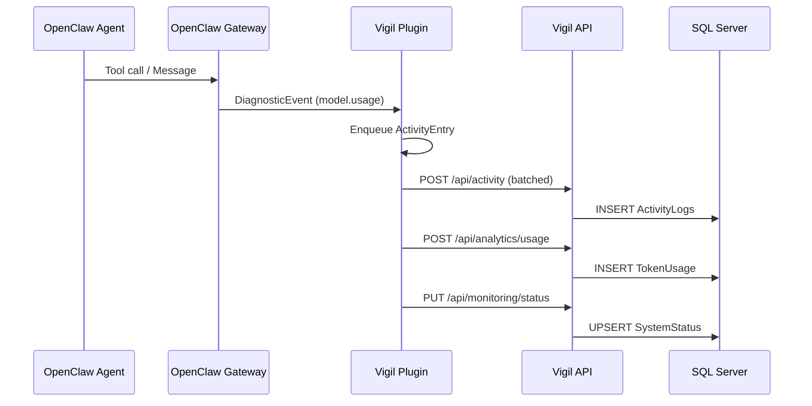
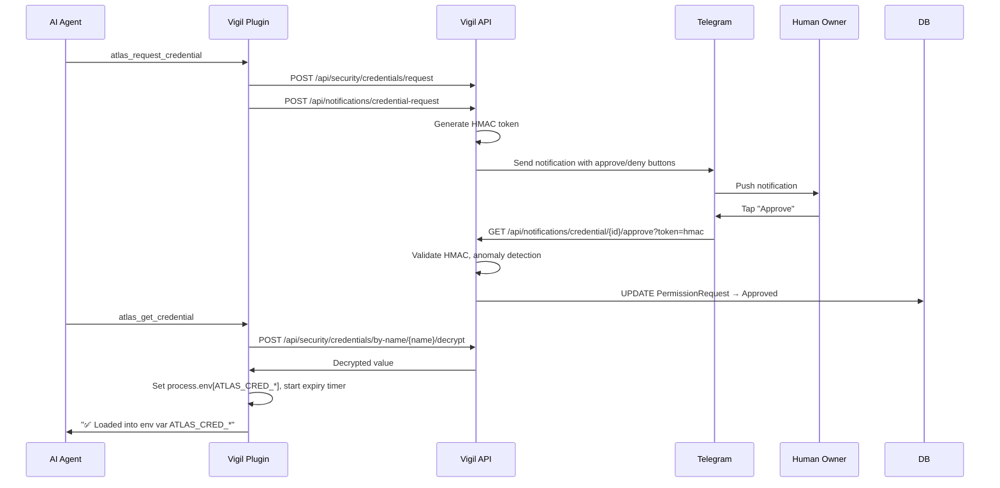

# Architecture Overview

Vigil (formerly Atlas Control Panel) is a self-hosted monitoring and management dashboard for OpenClaw AI agents. It provides real-time visibility into agent activity, cost tracking, credential management, and task orchestration.

## Tech Stack

| Layer | Technology |
|-------|-----------|
| **UI** | .NET 10 Blazor Server (Interactive SSR) + MudBlazor |
| **API** | ASP.NET Core Controllers (REST) |
| **ORM** | Dapper (micro-ORM) |
| **Database** | SQL Server (primary) + SQLite (planned) |
| **Real-time** | SignalR (NotificationHub, ActivityHub) |
| **Auth** | Cookie Authentication + API Key middleware |
| **Security** | AES-256 encrypted vault, HMAC approval tokens, ASP.NET Data Protection |
| **Plugin Runtime** | TypeScript, runs inside OpenClaw gateway via jiti |
| **Mobile Pairing** | QR code + secure token exchange |

## System Diagram

```mermaid
graph TB
    subgraph "OpenClaw Gateway"
        Plugin["atlas-control-panel Plugin<br/>(index.ts)"]
        Gateway["OpenClaw Core"]
    end

    subgraph "Vigil Server (.NET 10)"
        API["REST API Controllers"]
        Blazor["Blazor Server UI"]
        SignalR["SignalR Hubs"]
        Security["Security Services<br/>(HMAC, Vault, Lockout)"]
        Infra["Infrastructure Layer<br/>(Repositories, Health Guardian)"]
    end

    subgraph "External"
        Telegram["Telegram Bot API"]
        User["User (Browser/Mobile)"]
        DB[(SQL Server)]
    end

    Gateway -->|Diagnostic Events| Plugin
    Plugin -->|node:http requests<br/>(bypasses SSRF)| API
    API --> Infra
    Infra --> DB
    Blazor --> API
    SignalR --> User
    API -->|Push Notifications| Telegram
    Telegram -->|Approve/Deny callbacks| API
    User --> Blazor
    User --> Telegram
```

## Three Architectural Layers

### 1. Plugin (`~/.openclaw/extensions/atlas-control-panel/index.ts`)

The bridge between OpenClaw and Vigil. Runs inside the OpenClaw gateway process.

- **Intercepts diagnostic events** (`model.usage`, `message.processed`, `session.state`, `session.stuck`, `webhook.error`, `run.attempt`)
- **Registers agent tools** (`atlas_create_task`, `atlas_update_task`, `atlas_log_activity`, `atlas_set_project`, `atlas_request_credential`, `atlas_get_credential`)
- **Pushes data** to Vigil API via `node:http` (bypasses OpenClaw's SSRF guard on `globalThis.fetch`)
- **Manages credential env vars** with auto-expiry timers
- **Batches activity logs** (configurable interval, default 5s)
- **Pushes system status** every 30s

### 2. Features (Built-in Server Modules)

C# Blazor pages and API controllers that make up the Vigil dashboard. Gated by license tier (Free/Pro/Team).

**Pages:** Dashboard, ActivityLogPage, Analytics, Chat, Login, Monitoring, Security, Settings, Setup, TaskBoard

**Controllers:** ActivityController, AnalyticsController, CredentialController, HealthController, LicenseController, MonitoringController, NotificationController, PairingController, SecurityController, SetupController, TasksController

### 3. Skills (Prompt Packages)

Markdown + script packages that teach the AI how to use Vigil tools effectively. Distributed via ClawHub or bundled with licenses.

## Project Structure

```
AtlasControlPanel/
├── src/
│   ├── Atlas.Domain/          # Entities, Enums, Value Objects
│   │   └── Entities/          # ActivityLog, TaskItem, TokenUsage, SecureCredential, etc.
│   ├── Atlas.Application/     # Interfaces, Services
│   │   └── Common/Interfaces/ # Repository contracts (ITaskRepository, ICredentialRepository, etc.)
│   ├── Atlas.Infrastructure/  # Implementations
│   │   ├── Security/          # ApprovalTokenService, ApprovalLockoutService, EncryptedFileSecretStore, CredentialEncryption
│   │   ├── Repositories/      # Dapper repository implementations
│   │   ├── Services/          # HealthGuardianService, CostEfficiencyAnalyzer
│   │   └── Hubs/              # SignalR: NotificationHub, ActivityHub
│   ├── Atlas.Web/             # ASP.NET host
│   │   ├── Controllers/       # REST API controllers
│   │   ├── Components/        # Blazor root component (App.razor)
│   │   └── Services/          # TelegramNotificationService
│   └── Atlas.Shared/          # Shared Blazor pages (.razor)
│       └── Pages/             # Dashboard, TaskBoard, Analytics, Security, etc.
├── docs/                      # Documentation
└── scripts/                   # Deployment/patch scripts
```

## Data Flow

### Agent Activity Logging


### Credential Access Flow


## Database Support

**Primary:** SQL Server (all production features, stored procedures)

**Planned:** SQLite for lightweight/single-user deployments

The `IDbConnectionFactory` interface abstracts connection creation, making database swapping straightforward. All data access goes through Dapper with repository interfaces in `Atlas.Application.Common.Interfaces`.

## Networking

- Vigil runs on **port 5263** (HTTP, no HTTPS redirect)
- CORS restricted to localhost origins (`:3000`, `:5000`, `:5263`)
- Plugin communicates via `127.0.0.1:5263` using `node:http` to bypass OpenClaw's SSRF guard
- External notification URLs auto-detected via `api.ipify.org` for Telegram approve/deny buttons
- SignalR hubs at `/hubs/notifications` and `/hubs/activity`
