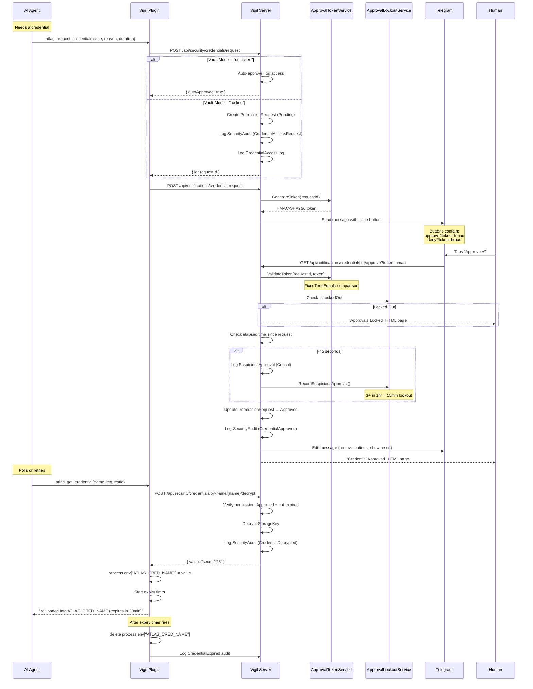

# Security Model

Vigil implements defense-in-depth security for AI agent credential access. The core principle: **the AI never sees secrets in conversation** — credentials flow through environment variables with automatic expiry.

## Credential Vault

### Encryption

Vigil uses two layers of encryption:

1. **ASP.NET Data Protection** (`CredentialEncryption`): Wraps credentials with `ENC:` prefix using the `Atlas.CredentialVault.v1` purpose string. Used for database-stored credentials.

2. **AES-256 Encrypted File Store** (`EncryptedFileSecretStore`): Cross-platform secret storage in `%APPDATA%/AtlasControlPanel/.vault`. Each entry is AES-256-CBC encrypted with a random IV prepended to the ciphertext.

### Key Derivation

The vault key is derived from:
```
SHA-256(ATLAS_VAULT_KEY env var ?? "{MachineName}:{UserName}:atlas-vault-v1")
```

Users can set the `ATLAS_VAULT_KEY` environment variable for custom key material. Without it, the key is deterministic per machine+user combination.

### Vault Modes

Each credential has a **vault mode**:

| Mode | Behavior |
|------|----------|
| `locked` (default) | Requires human approval via Telegram before access |
| `unlocked` | Auto-approves requests, logs access but skips approval flow |

Mode is set per-credential via `PUT /api/security/credentials/{id}/vault-mode`.

### Storage Model

```csharp
public class SecureCredential
{
    public string Name { get; set; }          // Human-readable name
    public string Category { get; set; }      // Grouping
    public string? Username { get; set; }     // Optional associated username
    public string StorageKey { get; set; }    // Encrypted value (ENC:...)
    public string VaultMode { get; set; }     // "locked" or "unlocked"
    public int AccessCount { get; set; }      // Total access count
    public DateTime? LastAccessedAt { get; set; }
}
```

## Approval Flow (End-to-End)



## HMAC Approval Tokens

The `ApprovalTokenService` generates tokens to prevent URL guessing attacks on approve/deny endpoints.

**How it works:**
1. Server generates 32-byte random secret on first start (persists to `appsettings.json`)
2. For each request: `token = Base64Url(HMAC-SHA256(secret, requestId))`
3. Token is embedded in Telegram button URLs
4. Validation uses `CryptographicOperations.FixedTimeEquals` (timing-safe)

**Configuration:**
```json
{
  "Security": {
    "ApprovalHmacSecret": "base64-encoded-32-byte-secret"
  }
}
```

If not configured, a random secret is generated and auto-persisted to `appsettings.json`.

## Anomaly Detection

### Rapid Approval Detection

If a credential request is approved within **5 seconds** of creation:

1. A `SuspiciousApproval` audit entry is created with `Critical` severity
2. `ApprovalLockoutService.RecordSuspiciousApproval()` is called
3. The approval **still goes through** (to avoid false-positive denial)

### Approval Lockout

The `ApprovalLockoutService` implements rate limiting:

| Parameter | Value |
|-----------|-------|
| Window | 1 hour (sliding) |
| Threshold | 3 suspicious approvals |
| Lockout duration | 15 minutes |
| Manual unlock | `POST /api/notifications/approval-lockout/unlock` |

When locked out, **all** credential approvals are blocked (both approve and deny). The lockout status is queryable via `GET /api/notifications/approval-lockout/status`.

## What Bots Can and Can't Do

### ✅ Bots CAN:
- Request credential access (creates audited permission request)
- Retrieve approved credentials as environment variables
- Create tasks, log activities, set project context
- Read activity logs, analytics, system status

### ❌ Bots CANNOT:
- See credential values in conversation (only env var names)
- Approve their own credential requests (requires HMAC token from Telegram)
- Approve credential requests via the general permission update endpoint (blocked with 403)
- Bypass the approval lockout
- Access credentials after expiry (env var is deleted by timer)
- Access credentials without a valid, non-expired permission request

### Endpoint Protection

```csharp
// Credential-type approvals blocked via general endpoint
if (dto.Status == PermissionStatus.Approved &&
    existing.RequestType == PermissionRequestType.CredentialAccess)
{
    return StatusCode(403, new { error = "Use the dedicated notification approve endpoint with HMAC token." });
}
```

## Authentication

### Cookie Auth
- Username/password login at `/api/auth/login`
- 30-day sliding expiration
- Used by the Blazor UI

### API Key Auth
- `X-Api-Key` header checked by middleware
- Configured in `appsettings.json` under `Api:Key`
- If no key configured, all API access is open (dev mode)
- Skipped for authenticated cookie sessions

### Excluded Routes
These routes bypass API key requirements:
- `/api/auth/*` — Login/logout
- `/api/chat/*` — Chat history
- `/api/notifications/credential/*` — Approve/deny callbacks (protected by HMAC instead)

## Audit Trail

Every security-relevant action is logged to `SecurityAudits` with severity levels:

| Severity | Events |
|----------|--------|
| **Info** | CredentialDenied, CredentialAccessAutoApproved, CredentialVaultModeChanged |
| **Warning** | CredentialAccessRequest, CredentialApproved, CredentialDecrypted, CredentialExpired |
| **Critical** | SuspiciousApproval (rapid approval detected) |

Additionally, `CredentialAccessLog` maintains a separate audit trail with:
- Which credential was accessed
- Who requested it
- Vault mode at time of access
- Whether it was auto-approved
- Timestamp and details
